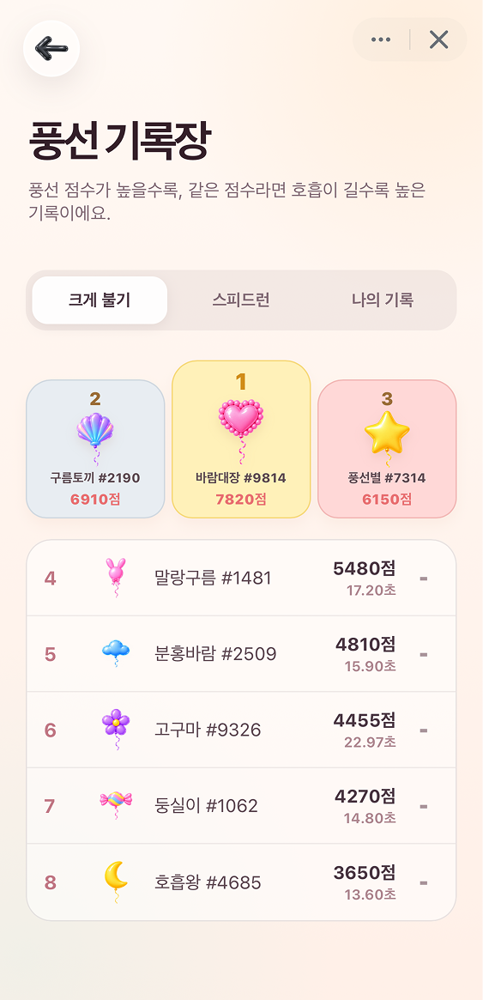
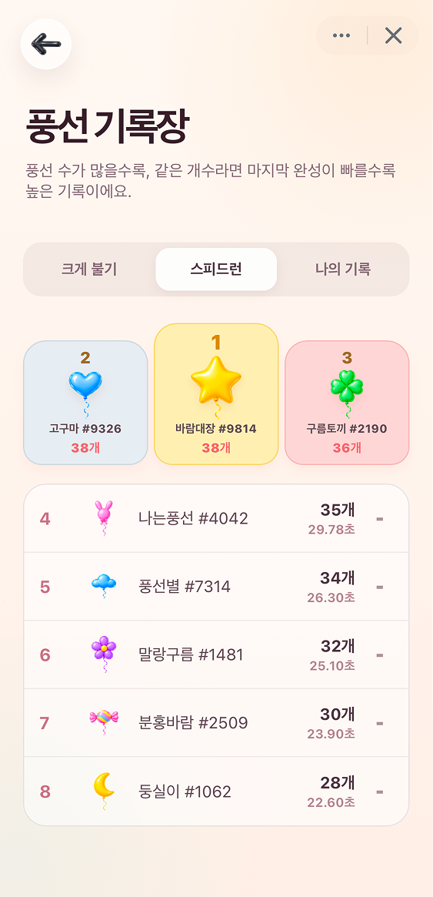

# 후우풍선 (`blow-balloon`)

마이크에 바람을 불어 풍선을 키우고 기록을 겨루는 Apps in Toss WebView 미니 게임입니다. React는 화면 흐름을, Canvas 2D는 실시간 풍선 렌더링과 물리를, Web Audio API는 마이크 신호 분석을 담당합니다.

> `풍선 크게 불기`는 마이크 입력으로 만드는 재미용 기록입니다. 실제 폐활량이나 의료 지표를 측정하지 않습니다.

## 주요 화면

<table>
  <tr>
    <td align="center">
      <strong>홈</strong><br />
      
    </td>
    <td align="center">
      <strong>풍선 크게 불기</strong><br />
      
    </td>
    <td align="center">
      <strong>풍선 스피드런</strong><br />
      
    </td>
  </tr>
  <tr>
    <td align="center">
      <strong>크게 불기 랭킹</strong><br />
      
    </td>
    <td align="center">
      <strong>스피드런 랭킹</strong><br />
      
    </td>
    <td align="center">
      <strong>나의 기록</strong><br />
      
    </td>
  </tr>
</table>

## 주요 기능

- **풍선 크게 불기:** 한 번의 호흡으로 풍선을 키우고 호흡 시간과 풍선 점수를 기록합니다. 매 시도마다 15종의 풍선 중 하나가 선택됩니다.
- **풍선 스피드런:** 30초 동안 최대한 많은 풍선을 완성합니다. 호흡을 멈춰도 현재 풍선 크기가 유지되며, 완성된 풍선은 위로 떠올라 서로 밀리고 압축되며 쌓입니다.
- **마이크 기반 조작:** Web Audio API로 마이크 신호를 기기 안에서 분석하고 주변 소음 기준값, RMS, 바람 세기 평활화와 호흡 상태를 게임 입력으로 변환합니다. 마이크 소리는 저장하거나 서버로 전송하지 않습니다.
- **Canvas 풍선 애니메이션:** React 렌더링과 분리된 `requestAnimationFrame` 루프에서 풍선 성장, 흔들림, 부력, 충돌과 상단 패킹을 처리합니다.
- **랭킹과 나의 기록:** 게임 중 예상 순위를 보여주고, 결과 화면에서 기록을 등록할 수 있습니다. 모드별 랭킹, 개인 최고 기록과 별명 변경도 지원합니다.
- **모바일 WebView 대응:** Apps in Toss Safe Area와 화면 켜짐 기능을 사용합니다. 백그라운드 전환 시 모드에 따라 게임을 일시정지하거나 현재 시도를 종료하고, 게임 이탈 시 마이크와 애니메이션 자원을 정리합니다.
- **개발용 테스트 입력:** 마이크를 사용할 수 없는 환경에서는 환경 변수로 버튼식 바람 입력을 활성화할 수 있습니다.

## 기술 스택

[](https://react.dev/)
[](https://www.typescriptlang.org/)
[](https://vite.dev/)
[](https://developers-apps-in-toss.toss.im/)
[](https://supabase.com/)
[](https://vitest.dev/)

게임 렌더링과 입력 처리에는 Canvas 2D, Web Audio API와 MediaDevices API를 사용합니다.

## 빠른 시작

요구 환경은 Node.js `^20.19.0` 또는 `>=22.12.0`, pnpm `11.16.0`입니다. Node.js 범위는 현재 Vite 패키지의 엔진 조건을 따릅니다.

```bash
pnpm install
cp .env.example .env.local
pnpm dev
```

`pnpm dev`는 활성 Wi-Fi 또는 Ethernet의 IPv4 주소와 `5173` 포트에서 Apps in Toss 개발 서버를 시작합니다. 네트워크가 바뀌면 서버를 다시 시작하세요.

### 환경 변수

`.env.local`에 공개 가능한 프런트엔드 설정만 넣습니다.

```dotenv
VITE_SUPABASE_URL=https://YOUR_PROJECT_REF.supabase.co
VITE_BLOW_BALLOON_TEST_MODE=false
```

| 변수 | 필수 여부 | 용도 |
| --- | --- | --- |
| `VITE_SUPABASE_URL` | 랭킹 기능에 필요 | `game-api` Edge Function 기본 주소를 구성합니다. |
| `VITE_BLOW_BALLOON_TEST_MODE` | 선택 | `true`이면 마이크 대신 화면의 `바람 불기` 버튼을 사용합니다. |

실제 관리자 키는 프런트엔드 환경 변수에 넣지 않습니다. Supabase 설정과 마이그레이션 순서는 [Supabase 안내](supabase/README.md)를 따르세요.

### 실제 마이크 테스트

`getUserMedia()`는 보안 컨텍스트가 필요합니다. Apps in Toss 샌드박스를 사용하거나 로컬 서버를 HTTPS 터널로 노출하세요.

```bash
# 터미널 1
pnpm dev

# 터미널 2
cloudflared tunnel --url http://localhost:5173
```

샌드박스에서 마이크를 사용할 수 없는 경우에만 `VITE_BLOW_BALLOON_TEST_MODE=true`로 설정합니다. 환경 변수를 바꾼 뒤 개발 서버를 다시 시작하세요.

## 명령어

```bash
pnpm dev        # Apps in Toss 개발 서버
pnpm typecheck  # TypeScript 프로젝트 검사
pnpm test       # Vitest 단위 테스트
pnpm lint       # ESLint 검사
pnpm build:web  # TypeScript 검사 후 Vite 웹 빌드
pnpm build      # Apps in Toss 산출물 빌드
pnpm deploy     # Apps in Toss 배포(외부 상태 변경)
```

`pnpm deploy`는 실제 배포 작업이므로 대상 환경과 권한을 확인한 뒤 실행하세요.

## 구조

```text
src/
├── audio/       마이크 입력, RMS 계산, 바람 상태 머신
├── api/         랭킹 Edge Function 클라이언트와 캐시
├── components/  홈 보조 UI, 결과, 랭킹, 바람 계기
├── game/        Canvas 엔진, 풍선 렌더링, 규칙과 물리
├── hooks/       마이크, Toss 사용자, Safe Area, 화면 켜짐
└── sdk/         Apps in Toss v2 호환 어댑터
supabase/
├── functions/   game-api Edge Function
├── migrations/  랭킹 데이터베이스 순차 마이그레이션
└── seeds/       검수용 랭킹 데이터 추가·제거 SQL
```

## 문서

- [기능 명세](docs/functional-specification.md): 사용자 기능, 정상·예외 흐름, 구현 상태
- [정보구조](docs/information-architecture.md): 화면 상태, 접근 조건, 사용자 여정
- [아키텍처](docs/architecture.md): 런타임 경계, 데이터 흐름, 배포 구조와 제약
- [API 명세](docs/api-specification.md): Edge Function HTTP 계약과 오류
- [ERD](docs/erd.md): Postgres 테이블, 관계, 제약과 접근 정책
- [Supabase 운영 안내](supabase/README.md): Dashboard 적용·배포·검증 절차
- [프런트엔드 연동 참고](supabase/FRONTEND_INTEGRATION.md): 랭킹 연동의 상세 계약
