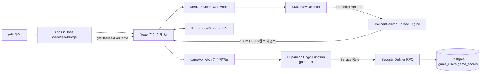
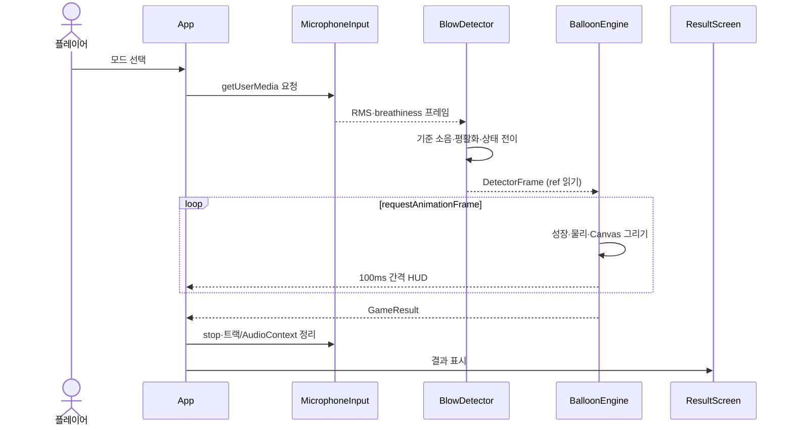
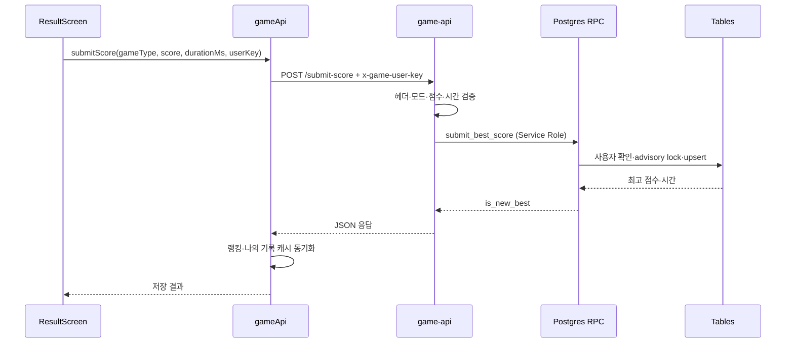
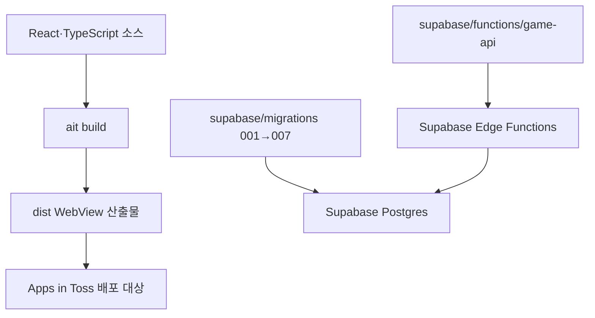

# 아키텍처

[README로 돌아가기](../README.md) · [API 명세](api-specification.md) · [ERD](erd.md)

## 시스템 범위

후우풍선은 Apps in Toss WebView에서 실행되는 React 단일 페이지 앱과, 선택적 랭킹 기능을 제공하는 Supabase 백엔드로 구성됩니다. 게임 루프와 오디오 분석은 기기 안에서 처리하고, 등록 사용자의 별명과 최고 기록만 HTTP API로 전송합니다.

## 컴포넌트 책임

| 컴포넌트 | 입력 | 책임·소유 상태 | 출력·외부 효과 | 근거 |
| --- | --- | --- | --- | --- |
| `App` | 사용자 행동, 훅 상태 | 화면·모드·HUD·결과 상태 머신 | 화면 전환, 게임/랭킹 컴포넌트 구성 | `src/App.tsx` |
| `useBlowDetector` | 마이크 또는 모의 바람 | 권한, 보정 표본, 감지 RAF, 최신 `DetectorFrame` ref | 저빈도 UI 프레임, 실시간 signal ref | `src/hooks/useBlowDetector.ts` |
| `MicrophoneInput` | MediaDevices | MediaStream, AudioContext, Analyser 버퍼 | RMS·주파수 비율, 자원 정리 | `src/audio/microphone.ts` |
| `BlowDetector` | RMS, 시간, breathiness | 기준 소음, 평활값, 호흡 상태 머신 | 바람 세기·호흡 상태 | `src/audio/blowDetector.ts` |
| `BalloonCanvas` | 모드, signal ref | Canvas 수명주기, RAF, resize·visibility | 렌더 루프, 중단 이벤트 | `src/game/BalloonCanvas.tsx` |
| `BalloonEngine` | DetectorFrame, delta time | 고빈도 풍선·물리·타이머 상태 | 100ms HUD, 최종 결과 | `src/game/BalloonEngine.ts` |
| `gameApi` | 사용자 키, 점수·별명 요청 | HTTP 계약, 메모리·localStorage 캐시 | Edge Function 호출, 캐시 동기화 | `src/api/gameApi.ts` |
| `game-api` | HTTP 요청 | 검증, 오류 매핑, 관리자 Supabase 클라이언트 | Service Role RPC 호출 | `supabase/functions/game-api/index.ts` |
| Postgres RPC | 검증된 인자 | 등록, 별명 변경, 최고 기록, 순위 계산 | 트랜잭션 데이터 변경·조회 | `supabase/migrations/*.sql` |

## 마이크에서 게임 결과까지

고빈도 위치·크기·물리 값은 `BalloonEngine` 필드에 있으며 React state에 매 프레임 저장하지 않습니다. React HUD는 약 100ms 간격으로만 갱신됩니다.

## 기록 저장 흐름

동일 사용자·게임 점수 제출은 Postgres advisory transaction lock으로 직렬화되고, 마지막 제출 후 3초 안의 재요청은 거부됩니다.

## 인증과 인가 경계

1. WebView는 `getUserKeyForGame()` 결과의 `hash`를 메모리에 보관합니다.
2. 클라이언트는 보호 API에 `x-game-user-key` 헤더를 보냅니다.
3. Edge Function은 헤더 형식만 검사하고 Service Role로 제한된 RPC를 호출합니다.
4. 테이블은 RLS를 강제하고 `anon`, `authenticated` 직접 권한을 회수합니다.
5. RPC 실행 권한은 `service_role`에만 부여됩니다.

현재 Edge Function은 Toss 발급값의 서버 서명이나 JWT를 독립적으로 검증하지 않습니다. 따라서 사용자 키를 아는 요청자를 실제 Toss 사용자로 증명하는 강한 인증 경계는 아니며, 이것이 확인된 주요 신뢰 제약입니다. CORS `*`도 인증 수단이 아닙니다.

## 데이터와 캐시

- 서버의 영속 데이터는 `game_users`, `game_scores` 두 테이블입니다.
- 브라우저 메모리는 공개 랭킹과 요청 Promise를 캐시합니다.
- `localStorage`에는 등록 사용자 표시 정보와 나의 기록 캐시를 사용자 키 기반 키 이름으로 저장합니다.
- 마이크 원본 오디오, RMS 이력, 전체 플레이 프레임은 저장하거나 전송하지 않습니다.
- 캐시를 사용할 수 없는 WebView에서는 예외를 무시하고 네트워크 결과로 동작합니다.

## 실패 격리와 수명주기

- 랭킹 사전 조회나 사용자 식별 실패는 게임 플레이를 막지 않습니다.
- 선택적 오디오 제약 요청이 실패하면 기본 오디오 요청으로 폴백합니다.
- 크게 불기 진행 중 백그라운드 이동은 시도를 중단합니다.
- 스피드런은 백그라운드에서 엔진 시간을 멈추고 복귀 시 재개합니다.
- 컴포넌트 해제 시 마이크 트랙, 오디오 노드, RAF, ResizeObserver와 이벤트를 정리합니다.
- 결과 제출 실패는 결과 화면에 남아 재시도를 허용합니다.

## 빌드와 배포 경계

- 프런트엔드 설정은 `granite.config.ts`가 소유하며 앱 이름, 브랜드, 마이크 권한, WebView 속성과 `dist` 출력 경로를 정의합니다.
- `pnpm build:web`은 TypeScript와 Vite 웹 빌드를, `pnpm build`는 Apps in Toss 빌드를 실행합니다.
- Supabase 스키마와 Edge Function은 프런트엔드와 별개로 적용·배포해야 합니다.
- 실제 Toss 및 Supabase 운영 배포 상태는 저장소만으로 확인할 수 없습니다.

## 알려진 제약

- 보정 표본 수집은 구현됐지만 보정 완료가 게임 시작의 강제 조건이 아닙니다.
- 크게 불기 엔진은 감지기의 `ending` 유예 상태를 성장 상태로 취급하지 않아 짧은 신호 저하에도 시도가 끝날 수 있습니다.
- 결과 이미지 생성기는 결과 UI와 연결되지 않았습니다.
- 홈의 크게 불기 설명은 동점 시 더 빠른 기록을 암시하지만, 실제 DB 정렬과 기록장 안내는 더 긴 호흡을 우선합니다.
- 점수는 클라이언트에서 계산되므로 서버는 범위와 빈도만 검증하며 실제 플레이를 증명하지 못합니다.
- 공개 랭킹은 3초 폴링이며 서버 푸시나 재시도 백오프가 없습니다.
- 기존 랭킹 인덱스는 `game_type, best_score desc, user_id`이고 모드별 시간 동점 정렬 컬럼은 포함하지 않습니다.
- 실기기별 마이크 자동 처리와 WebView 스펙트럼 품질 차이는 런타임 튜닝이 필요합니다.
