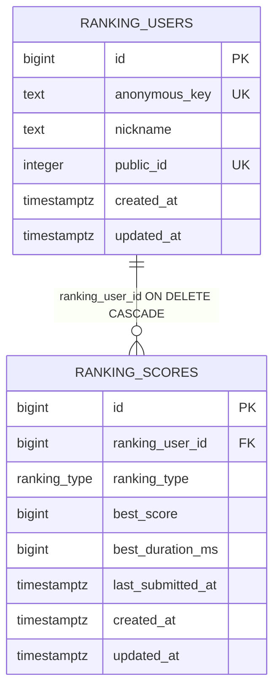

# ERD

[README로 돌아가기](../README.md) · [API 명세](api-specification.md)

이 문서는 `supabase/migrations/001_ranking_backend.sql`부터 `008_nongame_anonymous_identity_reset.sql`까지 순서대로 적용한 최종 스키마를 설명합니다.

## 데이터 모델

한 사용자는 랭킹 모드별 최대 한 개의 최고 기록을 가지며, 사용자가 삭제되면 연결된 점수도 삭제됩니다.

## `ranking_users`

| 필드 | 제약 | 역할 |
| --- | --- | --- |
| `id` | identity, PK | 내부 사용자 식별자 |
| `anonymous_key` | `NOT NULL`, unique, 1~255자, trim 유지 | Toss `getAnonymousKey()` 결과의 hash 식별값 |
| `nickname` | `NOT NULL`, 2~15자, trim 유지, `#`·제어문자 금지 | 공개 표시 별명 |
| `public_id` | `NOT NULL`, unique index | 1000~9999 범위에서 등록 시 무작위 생성되는 현재 4자리 표시 ID |
| `created_at` | `NOT NULL`, `now()` | 생성 시각 |
| `updated_at` | `NOT NULL`, `now()` | 별명 변경 등 갱신 시각 |

`is_safe_nickname()`과 Edge Function의 별도 검증이 금칙어와 정규화 우회를 차단합니다. 이 검사는 테이블 CHECK가 아니라 등록·변경 RPC 및 Edge Function 경로에서 수행됩니다.

## `ranking_scores`

| 필드 | 제약 | 역할 |
| --- | --- | --- |
| `id` | identity, PK | 점수 행 식별자 |
| `ranking_user_id` | `NOT NULL`, FK → `ranking_users.id`, `ON DELETE CASCADE` | 기록 소유자 |
| `ranking_type` | `NOT NULL`, enum | `BALLOON_COUNT` 또는 `LUNG_CAPACITY` |
| `best_score` | `NOT NULL`, 모드별 CHECK | 사용자의 해당 모드 최고 점수 |
| `best_duration_ms` | nullable, `0..86400000` CHECK | 크게 불기는 호흡 시간, 스피드런은 마지막 완성 시간 |
| `last_submitted_at` | `NOT NULL`, `now()` | 3초 제출 제한 기준 |
| `created_at` | `NOT NULL`, `now()` | 최초 기록 생성 시각 |
| `updated_at` | `NOT NULL`, `now()` | 더 좋은 기록으로 바뀐 시각 |

### 최종 점수 제약

- `BALLOON_COUNT`: `best_score` 0~50
- `LUNG_CAPACITY`: `best_score` 0~9999
- `(ranking_user_id, ranking_type)` unique: 사용자별·모드별 한 행
- `best_duration_ms`: null 또는 0~86,400,000ms

마이그레이션 003은 잠시 스피드런 상한을 30으로 낮췄고, 006에서 현재 상한 50으로 확장했습니다. 최종 상태 판단은 가장 나중에 적용되는 006과 007을 기준으로 합니다.

## 관계와 삭제 정책

| 부모 | 자식 | 카디널리티 | FK | 삭제 정책 |
| --- | --- | --- | --- | --- |
| `ranking_users` | `ranking_scores` | 1 : 0..N, 실제 enum 기준 최대 2행 | `ranking_scores.ranking_user_id` | `ON DELETE CASCADE` |

업데이트 cascade는 선언되어 있지 않습니다. 내부 `ranking_users.id`를 변경하는 실행 경로도 없습니다.

## 인덱스

| 인덱스·제약 | 컬럼 | 목적 |
| --- | --- | --- |
| `ranking_users_anonymous_key_unique` | `anonymous_key` | 사용자 키 단일 등록·조회 |
| `ranking_users_public_id_unique` | `public_id` | 현재 4자리 표시 ID 유일성 |
| `ranking_scores_user_type_unique` | `ranking_user_id, ranking_type` | 모드별 최고 기록 1행 보장 |
| `ranking_scores_lung_ranking_idx` | `best_score DESC, best_duration_ms DESC, ranking_user_id` | 크게 불기 랭킹 조회 |
| `ranking_scores_rush_ranking_idx` | `best_score DESC, best_duration_ms ASC, ranking_user_id` | 스피드런 랭킹 조회 |

두 랭킹 인덱스는 `ranking_type`별 partial index이며 각 모드의 동점 시간 정렬 방향까지 포함합니다.

## 접근 정책과 민감 데이터

- 두 테이블 모두 RLS를 활성화하고 강제합니다.
- `anon`, `authenticated` 역할의 테이블·시퀀스 직접 권한은 회수됩니다.
- `SECURITY DEFINER` RPC의 실행 권한도 공개 역할에서 회수되고 `service_role`에만 부여됩니다.
- Edge Function이 관리자 키로 RPC를 호출합니다.
- `anonymous_key`는 Toss가 반환한 hash 식별값이지만 사용자 연결이 가능한 식별 데이터입니다. 스키마에는 별도 암호화·해시 재처리 근거가 없습니다.
- 서비스 키, 토큰, 마이크 데이터는 이 두 테이블에 저장되지 않습니다.

## RPC 데이터 경계

| RPC | 읽기·변경 데이터 | 주요 보장 |
| --- | --- | --- |
| `get_ranking_user` | `ranking_users` 조회 | 사용자 키에 대응하는 공개 프로필만 반환 |
| `register_ranking_user` | `ranking_users` 삽입/기존 행 조회 | 고정 `public_id`, 중복 키 재등록 방지 |
| `update_ranking_nickname` | `ranking_users.nickname` 갱신 | `public_id` 유지 |
| `submit_best_ranking_score` | `ranking_users` 조회, `ranking_scores` 삽입/갱신 | advisory lock, 3초 제한, 모드별 최고 기록 비교 |
| `get_ranking` | 두 테이블 조인 조회 | 상위 100, 모드별 시간 동점 규칙 |
| `get_ranking_records` | 두 테이블 조회 | 두 모드 기록과 현재 순위 반환 |

## 확인이 필요한 사항

- 운영 데이터베이스에 001~008이 모두 순서대로 적용되었는지는 저장소만으로 확인할 수 없습니다.
- 백업, 보존 기간, 사용자 삭제 요청 처리 절차와 저장 시 암호화 정책은 저장소에 정의되어 있지 않습니다.
- `008`은 기존 사용자와 기록을 초기화하므로 운영 데이터가 생긴 뒤에는 별도의 무손실 마이그레이션이 필요합니다.
