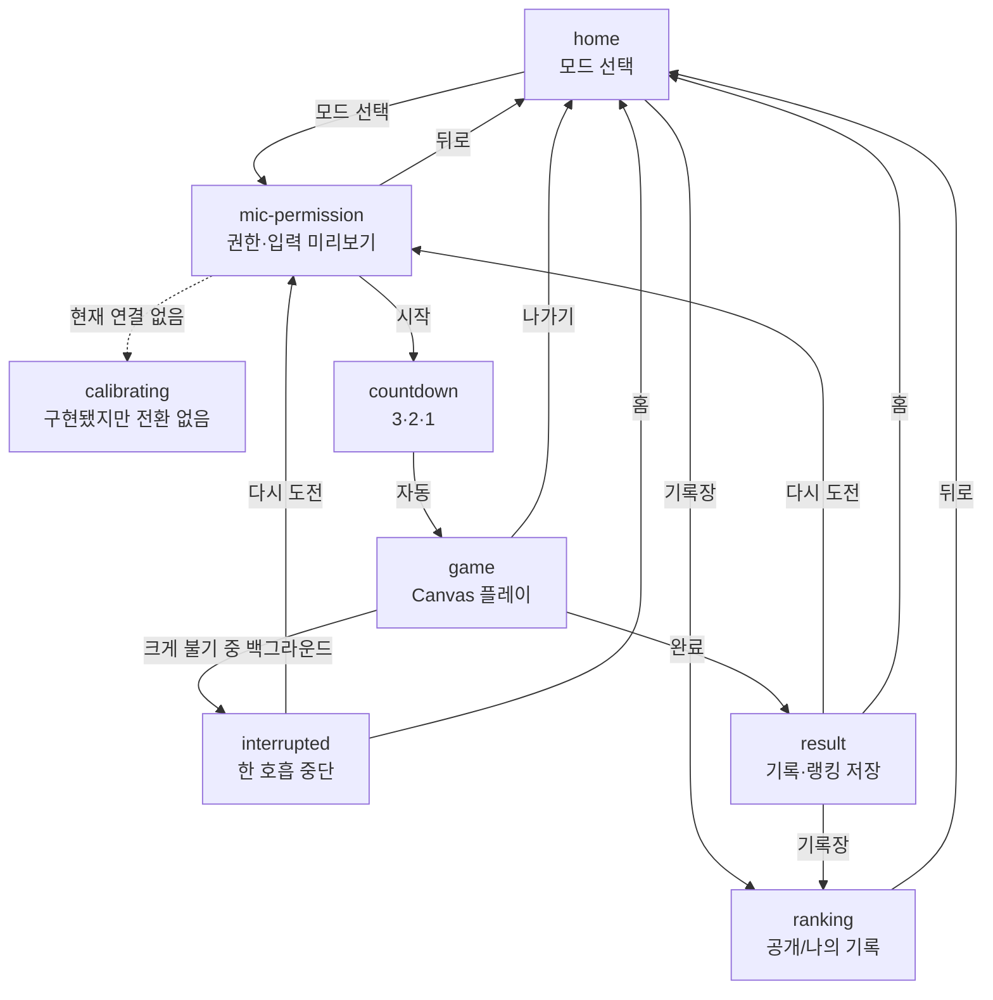
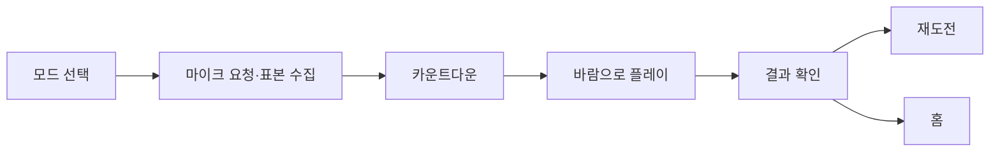
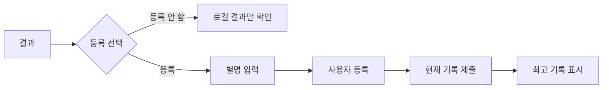

# 정보구조

[README로 돌아가기](../README.md) · [기능 명세](functional-specification.md)

이 앱은 URL 라우터 없이 `AppScreen` 상태로 화면을 전환하는 단일 페이지 WebView입니다.

## 사용자 유형과 접근

| 사용자 유형 | 플레이 | 공개 랭킹 | 기록 제출 | 나의 기록 | 별명 변경 |
| --- | --- | --- | --- | --- | --- |
| 사용자 키 없음 | 가능 | 가능 | 불가 | 불가 | 불가 |
| Toss 키가 있는 미등록 사용자 | 가능 | 가능 | 별명 등록 후 가능 | 등록 전 불가 | 등록 후 가능 |
| 등록 사용자 | 가능 | 가능 | 결과 진입 시 자동 | 가능 | 가능 |

화면 노출 조건은 클라이언트 UI 조건이며, 서버 접근 통제는 `x-game-user-key`, Edge Function 검증과 Service Role 전용 RPC가 담당합니다.

## 화면 구조

| 화면 식별자 | 목적 | 진입 조건 | 주요 행동 | 다음 화면 | 상태 |
| --- | --- | --- | --- | --- | --- |
| `home` | 모드 선택과 기록 미리보기 | 앱 시작 또는 홈 이동 | 두 게임 선택, 기록장 열기 | `mic-permission`, `ranking` | 구현 완료 |
| `mic-permission` | 마이크 시작과 바람 미리보기 | 모드 선택 | 권한 재시도, 카운트다운 시작, 홈 | `countdown`, `home` | 구현 완료 |
| `calibrating` | 주변 소음 보정 안내 | 전환 경로 없음 | 재시도, 홈 | 의도상 `countdown` | **접근 불가** |
| `countdown` | 3·2·1 시작 안내 | 권한 화면의 시작 버튼 | 자동 카운트다운 | `game` | 구현 완료 |
| `game` | Canvas 게임과 HUD | 카운트다운 종료 | 불기, 나가기 | `result`, `interrupted`, `home` | 구현 완료 |
| `interrupted` | 크게 불기 백그라운드 중단 안내 | 시작된 호흡 중 문서 숨김 | 다시 도전, 홈 | `mic-permission`, `home` | 구현 완료 |
| `result` | 기록·랭킹 저장 결과 | 게임 완료 | 등록/저장, 기록장, 재도전, 홈 | `ranking`, `mic-permission`, `home` | 구현 완료 |
| `ranking` | 공개 랭킹과 나의 기록 | 홈·결과에서 열기 | 게임 탭, 나의 기록, 별명 변경 | `home` | 구현 완료 |

`calibrating` 상태와 UI는 선언되어 있지만 `setScreen('calibrating')` 호출이 없어 현재 사용자 여정에 포함되지 않습니다.

## 화면 전이

실선은 실제 `setScreen()` 전이이며 점선은 현재 연결되지 않은 상태를 나타냅니다. 근거는 `src/App.tsx`입니다.

## 주요 사용자 여정

### 게임 플레이

마이크 권한은 앱 시작 시가 아니라 모드 버튼을 누른 뒤 요청됩니다. 다만 권한 승인 직후 보정 완료 여부를 기다리는 UI gate는 없습니다.

### 첫 랭킹 등록

### 기록장

`ranking` 화면 안에서 URL 변경 없이 다음 탭을 전환합니다.

- `크게 불기`: 공개 `LUNG_CAPACITY` 순위
- `스피드런`: 공개 `BALLOON_COUNT` 순위
- `나의 기록`: 등록 사용자의 두 최고 기록과 별명 변경

공개 랭킹은 사용자 키 없이 접근하며, 나의 기록과 별명 변경은 등록된 사용자 키가 있어야 합니다.

## 조건부·미구현 UI

- 결과 이미지 생성 버튼과 미리보기는 없습니다. 생성 모듈만 존재합니다.
- `calibrating` 화면은 렌더링 코드가 있으나 현재 접근할 수 없습니다.
- 개발 환경 `?debug`에서만 진단 오버레이가 나타납니다.
- `VITE_BLOW_BALLOON_TEST_MODE=true`이면 권한 화면과 게임 화면에 버튼식 바람 입력이 추가됩니다.
